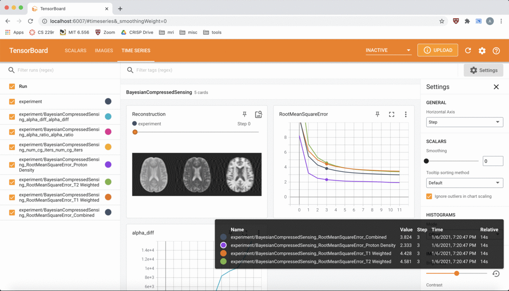

# MultiCore

**MultiCore** is a Python package for **multi**-**co**ntrast **re**construction of magnetic resonance images (MRIs).  Powered by [PyTorch](https://pytorch.org/), this library is designed to exploit parallel computing on *multi-core* processors -- whether in the form of CPUs or GPUs -- to maximally accelerate reconstruction time.  MultiCore is also equipped with [TensorBoard](https://www.tensorflow.org/tensorboard) support, so that users may view images and track metrics as reconstruction takes place.




To install the software, clone this repository and run the following commands:
```
cd multicore-mri
pip install -e .
```

Then, you can run an example on the SRI 24 atlas with the following command:
```
python multicore/experiment.py dataset=atlas algorithm=bayesian_cs dataset.samp_type=y algorithm.alpha_init=1e3 algorithm.num_em_iters=15 algorithm.num_init_cg_iters=32 algorithm.num_probes=8 algorithm.alpha0=1e6 algorithm.grad_dim=xy dataset.samp_factor=0.249
```
